<h1>Hello World! </h1>

My name is **Rithik**, and I'm currently a final year Software Engineering student at the University of Guelph. Lately I've been getting been sharpening my skills on **Data Structures** and **Algorithms**!

 
A handful of my skills 🛠️
  

   

 

 
 

 

<picture>
    
</picture>
<picture>
    
</picture>

<h1 style="margin-top: 5px;"> Recent Shenanigans </h1>

- 🧠 Messing around on LeetCode
- 🕹️ Tinkering with Three.js
- 📚 Writing a paper (to be published at GI 2024)
- 👨🏽‍💻 Freelancing full-stack commissioned software

 
Check out my 📌 Pinned Projects below!

<!-- 

 -->

<!-- 

<h1 style="margin-top: 35px;"> Recent Shenanigans </h1>

- 🧠 Messing around on LeetCode
- 🕹️ Tinkering with Three.js
- 📚 Writing a paper (to be published at GI 2024)
- 👨🏽‍💻 Freelancing full-stack commissioned software

 
Check out my 📌 Pinned Projects below!

 -->

<h2 style="text-align: center;">Contact Me 💬 </h2>

  
  
  

